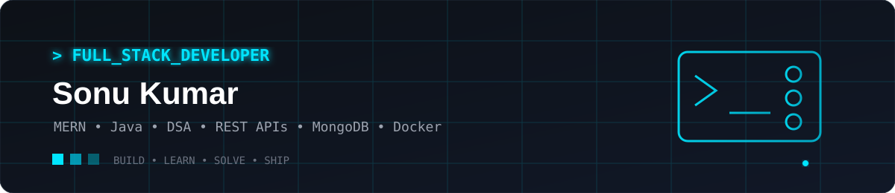
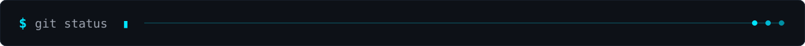
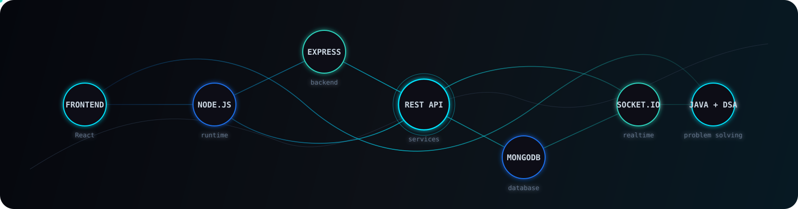
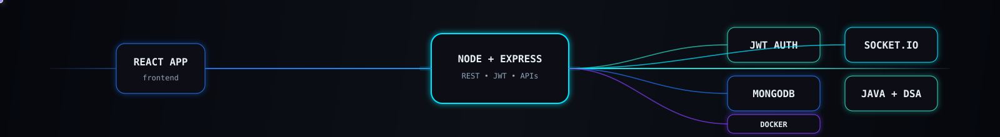
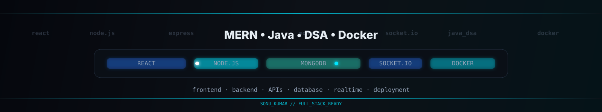

<p align="center">
  
</p>

<p align="center">
  <a href="https://github.com/imsonukalwar">
    
  </a>
</p>

<p align="center">
  <a href="https://github.com/imsonukalwar">
    
  </a>

  <a href="https://leetcode.com/">
    
  </a>

  <a href="https://www.geeksforgeeks.org/">
    
  </a>

  <a href="https://github.com/imsonukalwar?tab=repositories">
    
  </a>
</p>

<p align="center">
  
</p>


<h2 align="center">⚡ About Me</h2>

<!-- <p align="center">
  
</p> -->

<p align="center">
  <samp>
    I’m Sonu Kumar, a Computer Science & Engineering graduate<br/>
    passionate about building modern web applications and solving problems with code.
  </samp>
</p> 

<br/>

<table align="center">
<tr>
<td width="50%" valign="top">

### 🚀 What I Do

* ⚡ Build **MERN Stack** applications
* 🔧 Develop **REST APIs** with Node.js & Express
* 🧠 Solve **DSA problems using Java**
* 💬 Build **real-time applications** with Socket.IO
* 🗄️ Work with **MongoDB & Mongoose**
* 🐳 Explore **Docker & deployment**

</td>

<td width="50%" valign="top">

### 🛠️ Current Focus

```text
Java + DSA
     ↓
MERN Stack
     ↓
Backend Development
     ↓
Docker & DevOps
     ↓
Building Better Projects 🚀
```

</td>
</tr>
</table>
<br/>
<p align="center">

<p align="center">
  
</p>

  <p align="center">
  
</p>


<p align="center">
  
</p>


  <samp>
    💡 Learn → Build → Break → Debug → Improve → Repeat
  </samp>
</p>
<p align="center">
  
</p>

<!-- ==================== TECHNICAL SKILLS ==================== -->

<h2 align="center">⚡ Technical Skills</h2>

<!-- <p align="center">
  
</p> -->

<br>

<!-- ==================== SKILL FLOW ==================== -->

<p align="center">
  
</p>

<table align="center">
  <tr>
    <td align="center" width="25%">

### 🎨 Frontend


<br>


<br><br>

`HTML` • `CSS` • `JavaScript`  
`React` • `Vite` • `Tailwind CSS`

</td>

<td align="center" width="25%">

### ⚙️ Backend


<br><br>

`Node.js` • `Express.js`  
`Java` • `REST APIs`

<br>

`Socket.IO` • `JWT`

</td>

<td align="center" width="25%">

### 🗄️ Database


<br><br>

`MongoDB`  
`Mongoose`  
`Firebase`

<br>

`Database Design`  
`CRUD Operations`

</td>

<td align="center" width="25%">

### 🛠️ Tools


<br><br>

`Git` • `GitHub`  
`Docker` • `Postman`

<br>

`VS Code`  
`npm` • `REST Client`

</td>
  </tr>
</table>

<br>

<!-- ==================== DEVELOPMENT PIPELINE ==================== -->

<h3 align="center">🚀 Development Workflow</h3>

<details>
  <summary>
    <strong> ⚡ Core Full Stack Capabilities</strong>
  </summary>

  <br>

  <!-- FRONTEND -->
  <table width="100%">
    <tr>
      <td>

### 🎨 Frontend Development

⚡ **HTML5** &nbsp; • &nbsp;
🎨 **CSS3** &nbsp; • &nbsp;
🟨 **JavaScript ES6+** &nbsp; • &nbsp;
⚛️ **React.js** &nbsp; • &nbsp;
⚡ **Vite** &nbsp; • &nbsp;
🎨 **Tailwind CSS** &nbsp; • &nbsp;
🔄 **Redux Toolkit**

      </td>
    </tr>
  </table>

  <br>

  <!-- BACKEND -->
  <table width="100%">
    <tr>
      <td>

### ⚙️ Backend Development

🟢 **Node.js** &nbsp; • &nbsp;
🚀 **Express.js** &nbsp; • &nbsp;
🔗 **REST APIs** &nbsp; • &nbsp;
🛡️ **Middleware** &nbsp; • &nbsp;
🔐 **JWT Authentication** &nbsp; • &nbsp;
🍪 **Cookies** &nbsp; • &nbsp;
📧 **Email Verification**

      </td>
    </tr>
  </table>

  <br>

  <!-- DATABASE -->
  <table width="100%">
    <tr>
      <td>

### 🗄️ Database & Storage

🍃 **MongoDB** &nbsp; • &nbsp;
🧩 **Mongoose** &nbsp; • &nbsp;
🔥 **Firebase** &nbsp; • &nbsp;
🏗️ **Schema Design** &nbsp; • &nbsp;
✏️ **CRUD Operations** &nbsp; • &nbsp;
☁️ **Cloudinary** &nbsp; • &nbsp;
📁 **File Uploads**

      </td>
    </tr>
  </table>

  <br>

  <!-- REAL TIME -->
  <table width="100%">
    <tr>
      <td>

### 💬 Real-Time & Integrations

⚡ **Socket.IO** &nbsp; • &nbsp;
💬 **Real-Time Messaging** &nbsp; • &nbsp;
🟢 **Online Users** &nbsp; • &nbsp;
💳 **Razorpay** &nbsp; • &nbsp;
📮 **Nodemailer** &nbsp; • &nbsp;
📧 **Resend** &nbsp; • &nbsp;
🔌 **Third-Party APIs**

      </td>
    </tr>
  </table>

  <br>

  <!-- DEVOPS -->
  <table width="100%">
    <tr>
      <td>

### 🐳 DevOps & Developer Tools

🐳 **Docker** &nbsp; • &nbsp;
🌿 **Git** &nbsp; • &nbsp;
🐙 **GitHub** &nbsp; • &nbsp;
📮 **Postman** &nbsp; • &nbsp;
📦 **npm** &nbsp; • &nbsp;
💻 **VS Code** &nbsp; • &nbsp;
🚀 **Deployment & Debugging**

      </td>
    </tr>
  </table>

  <br>

  <!-- PROGRAMMING -->
  <table width="100%">
    <tr>
      <td>

### 🧠 Programming & DSA

☕ **Java** &nbsp; • &nbsp;
🟨 **JavaScript** &nbsp; • &nbsp;
🔢 **Arrays** &nbsp; • &nbsp;
🔤 **Strings** &nbsp; • &nbsp;
🔄 **Sorting** &nbsp; • &nbsp;
🔎 **Searching** &nbsp; • &nbsp;
↔️ **Two Pointers** &nbsp; • &nbsp;
🪟 **Sliding Window** &nbsp; • &nbsp;
🔁 **Recursion** &nbsp; • &nbsp;
🔗 **Linked List**

      </td>
    </tr>
  </table>

  <br>

  <!-- ANIMATED FLOW -->
  <p align="center">
    
  </p>

</details>


<p align="center">
  
</p>


<p align="center">
  
</p>

<br>

<table align="center">
  <tr>
    <td align="center">

### 💻 Programming


<br><br>

**Java** • **JavaScript**

</td>

<td align="center">

### 🧠 Problem Solving

**DSA**

<br>

`Arrays` • `Strings`  
`Two Pointers` • `Sliding Window`  
`Sorting` • `Searching`  
`Recursion` • `Linked List`

</td>

<td align="center">


### 🔐 Backend Engineering

`REST API`

<br>

`Authentication`  
`JWT` • `Cookies`

<br>

`Socket.IO`  
`Error Handling`

</td>
  </tr>
</table>

<!-- ===================================================================================== -->
<p align="center">
  
</p>


<br>

<!-- ==================== CORE STACK ==================== -->

<h3 align="center">🔥 Core Stack</h3>

<p align="center">
  
</p>

<br>

<p align="center">
  
</p>

<p align="center">
  <samp>
    ⚡ BUILD &nbsp;•&nbsp; 🧠 SOLVE &nbsp;•&nbsp; 🔧 DEBUG &nbsp;•&nbsp; 🚀 DEPLOY
  </samp>
</p>


<h2 align="center">🚀 Featured Projects</h2>

<p align="center">
  
</p>

<br>

<table align="center">
<tr>

<td width="33%" valign="top" align="center">

<h3>🛒 Ekart</h3>

<b>MERN E-Commerce</b>

<p>
React • Node • Express<br>
MongoDB • Redux
</p>

<a href="https://e-commerce-web-hmsh.vercel.app/">

</a>

</td>

<td width="33%" valign="top" align="center">

<h3>💬 Chatter</h3>

<b>Real-Time Chat</b>

<p>
React • Node • Express<br>
MongoDB • Socket.IO
</p>

<a href="https://chatter10.netlify.app/">

</a>

</td>

<td width="33%" valign="top" align="center">

<h3>🤖 WebsiteBuilder</h3>

<b>AI Website Builder</b>

<p>
React • Node • Express<br>
MongoDB • OpenRouter
</p>

<a href="https://github.com/imsonukalwar">

</a>

</td>

</tr>

<tr>

<td width="33%" valign="top" align="center">

<h3>🌤️ Weather</h3>

<b>Weather Application</b>

<p>
React • JavaScript<br>
REST API • Axios
</p>

<a href="https://weathersonu.netlify.app/">

</a>

</td>

<td width="33%" valign="top" align="center">

<h3>👨‍💻 Portfolio</h3>

<b>Developer Portfolio</b>

<p>
React • JavaScript<br>
CSS • Responsive UI
</p>

<a href="https://sonuportfolioo.netlify.app/">

</a>

</td>

<td width="33%" valign="top" align="center">

<h3>🧠 DSA</h3>

<b>Problem Solving</b>

<p>
Java • DSA<br>
LeetCode • GFG
</p>

<a href="https://github.com/imsonukalwar">

</a>

</td>

</tr>
</table>

<br>

<p align="center">

</p>


## GitHub Analytics

<!--
  Dynamic SVG providers are used where they preserve the current visual layout.
  The two custom local cards below are refreshed weekly by .github/workflows/profile-assets.yml
  only when the semantic SVG content changes.

  Dynamic alternatives if you ever want zero committed analytics SVGs:
  - GitHub stats: https://github-readme-stats.vercel.app/api?username=sibasundarj8
  - Top languages: https://github-readme-stats.vercel.app/api/top-langs/?username=sibasundarj8
-->

<table>
  <tr>
    <td width="50%" valign="top">
      
    </td>
    <td width="50%" valign="top">
      <picture>
        <source
          srcset="https://streak-stats.demolab.com?user=imsonukalwar&amp;theme=github-dark-blue&amp;hide_border=true&amp;background=0D1117&amp;stroke=1F6FEB&amp;ring=00E5FF&amp;fire=FFB000&amp;currStreakNum=E6EDF3&amp;sideNums=E6EDF3&amp;currStreakLabel=9BA8B7&amp;sideLabels=9BA8B7&amp;dates=64748B"
          media="(prefers-color-scheme: dark)"
        />
        <source
          srcset="https://streak-stats.demolab.com?user=imsonukalwar&amp;theme=default&amp;hide_border=true&amp;background=FFFFFF&amp;stroke=CBD5E1&amp;ring=0366D6&amp;fire=FF8A00&amp;currStreakNum=0D1117&amp;sideNums=0D1117&amp;currStreakLabel=334155&amp;sideLabels=334155&amp;dates=64748B"
          media="(prefers-color-scheme: light), (prefers-color-scheme: no-preference)"
        />
        
      </picture>
    </td>
  </tr>
  <tr>
    <td colspan="2" align="center">
      
    </td>
  </tr>
</table>

<p align="center">
  <picture>
    <source
      srcset="https://github-readme-activity-graph.vercel.app/graph?username=imsonukalwar&amp;theme=react-dark&amp;hide_border=true&amp;bg_color=0D1117&amp;color=9BA8B7&amp;line=00E5FF&amp;point=FFFFFF&amp;area=true&amp;area_color=00E5FF"
      media="(prefers-color-scheme: dark)"
    />
    <source
      srcset="https://github-readme-activity-graph.vercel.app/graph?username=imsonukalwar&amp;theme=github-light&amp;hide_border=true&amp;bg_color=FFFFFF&amp;color=334155&amp;line=0366D6&amp;point=0D1117&amp;area=true&amp;area_color=0366D6"
      media="(prefers-color-scheme: light), (prefers-color-scheme: no-preference)"
    />
    
  </picture>
</p>

### Contribution Snake

<!-- The snake SVGs are refreshed weekly on the output branch and published only when the generated SVG content changes. -->

<p align="center">
    <picture>
      <source media="(prefers-color-scheme: dark)" srcset="https://raw.githubusercontent.com/imsonukalwar/imsonukalwar/output/github-contribution-grid-snake-dark.svg" />
      <source media="(prefers-color-scheme: light), (prefers-color-scheme: no-preference)" srcset="https://raw.githubusercontent.com/imsonukalwar/imsonukalwar/output/github-contribution-grid-snake.svg" />
      
    </picture>
  </p>

<p align="center">
  
</p>

